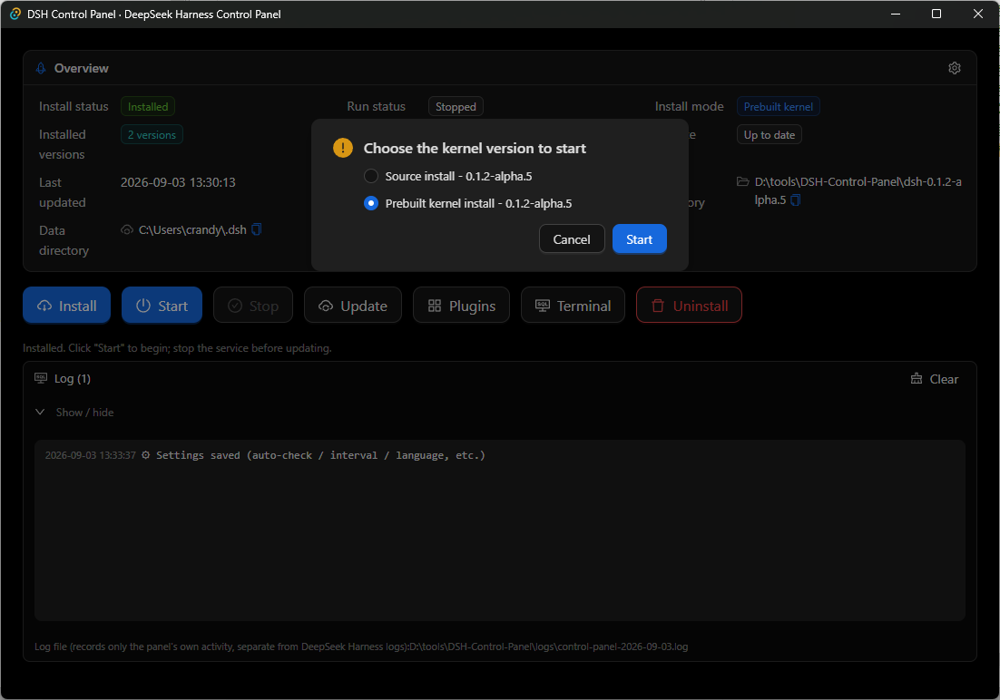
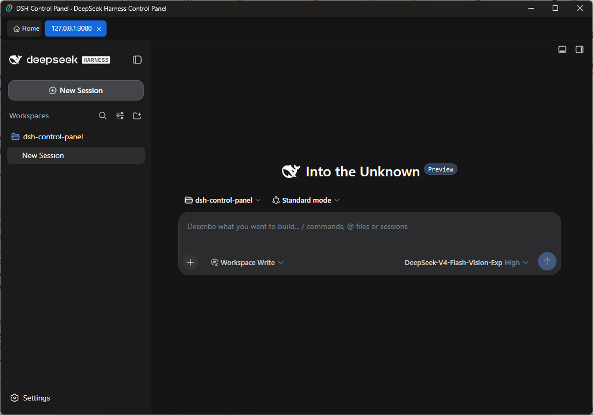
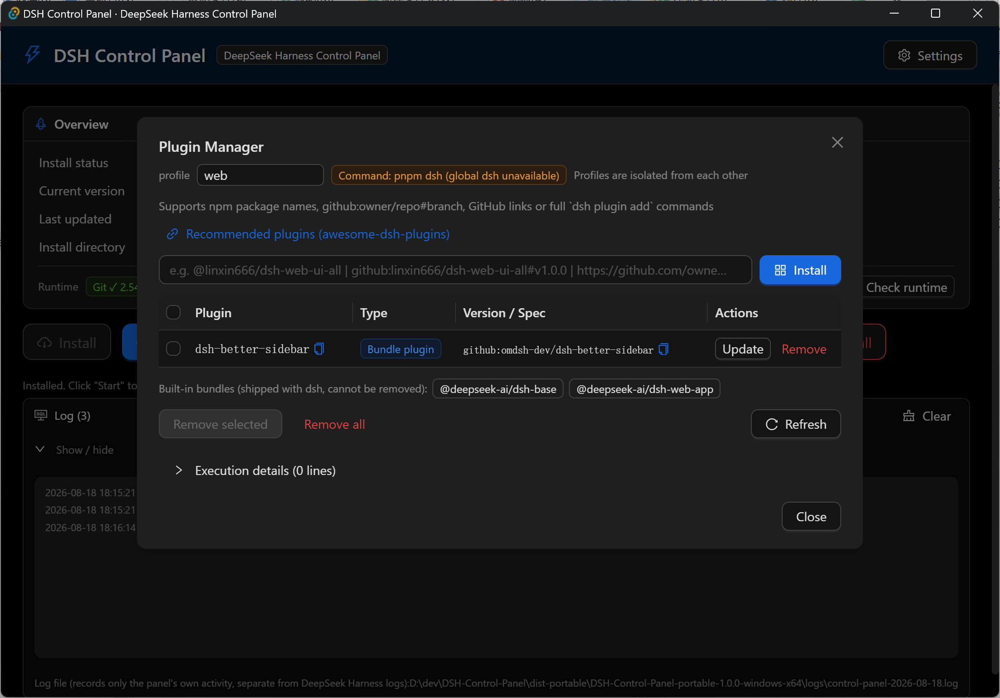

# DSH Control Panel

[](LICENSE)
[](https://github.com/CrandyChen/dsh-control-panel/actions/workflows/build.yml)

**DSH Control Panel** is a Windows desktop GUI for [DeepSeek Harness](https://github.com/deepseek-ai/deepseek-harness) (DSH): install, start, stop, update, repair, uninstall, run DeepSeek Harness, and manage its plugins. It can also be used as DSH's desktop client.

[简体中文](README.md)

## What is this?

DSH Control Panel wraps DeepSeek Harness's common terminal operations — **install**, **update**, **uninstall**, **start**, **stop**, **repair**, and **plugin management** — into a graphical interface for easy use. It also has the DeepSeek Harness web page built in, so it can be used as DSH's desktop client.

- **Self-contained & portable**: Built with Tauri 2; a portable build (under 10 MB) that runs right after extraction; Node.js and other dependencies are downloaded automatically on first install.
- **DSH dual install modes**: Installs by downloading the **prebuilt kernel** by default, or you can choose to build and install automatically from the official source.
- **Multi-version kernel management**: Install and manage multiple DSH kernel versions at once; kernels are independent of one another and can be started as needed. All versions share the same data directory (~/.dsh — API credentials, session history, plugins, etc.).
- **Stay up-to-date**: Automatically checks the latest DSH version; you can update to the latest.
- **Non-intrusive to DSH**: Only wraps DSH-related CLI operations without modifying its source code.

## System Requirements

| Item | Notes |
| --- | --- |
| Windows | 10 / 11 (64-bit) |
| WebView2 Runtime | Included in Win11; install from Microsoft for Win10 if missing |

The program has built-in Git client support; Node.js and pnpm are downloaded automatically on first install — none requires a separate install.

## Installing DeepSeek Harness (two modes, multiple versions)

The install location is fixed to the control panel's own directory. Prebuilt kernels are extracted into a `dsh-<version>` subdirectory per version (independent, can coexist); a source install is cloned into a `dsh-src-<version>` subdirectory per version (independent, can coexist). On startup the program detects any DSH installation in this directory  and automatically adopts one if already present.

Click "Install" and choose an install mode:

- **Prebuilt kernel (default)**: The dialog lists the installable versions published on GitHub ([deepseek-harness-pkg](https://github.com/dsh-tauri-desk/deepseek-harness-pkg)), so you can pick any one, or install the latest directly. An already-installed version is marked **Installed** and offers **Repair install**.
- **From official source**: Automatically installs the latest version from the official repository (`git clone` of the official source → `pnpm install` → `pnpm run build`). When already installed, this mode offers **Repair install**.

## Feature Overview

### 1. DSH Start / Stop
- Clicking "Start" opens a picker when multiple kernel versions are installed, letting you choose which kernel to start.
- Starts the DeepSeek Harness web service; once ready, it opens automatically according to the "Default UI open mode" setting, via an in-app tab or the system default browser. "Stop" terminates the entire process tree.
- Runs in the background: DSH keeps running as an independent process; closing the panel does not affect it.

### 2. DSH Update
- Checks for updates according to your install mode: the prebuilt kernel compares against the latest release of [deepseek-harness-pkg](https://github.com/dsh-tauri-desk/deepseek-harness-pkg); the source mode compares against the CLI version on the official source repository.
- An automatic background check shows a red **NEW** badge on the Update button when a new version is found; the web service is stopped automatically before updating.
- Clicking "Update" opens a dialog that lists every installed kernel in a simple table (install mode / current version / new version) and lets you select which kernels to update (you can select across install modes). Selecting multiple versions of the same install mode only installs that mode's latest version.
- The dialog notes that, after updating, the old kernels corresponding to the selected versions will be replaced (their directories will be removed). The updated new kernel is installed as an independent kernel and becomes the current one; unselected versions can still be switched to or uninstalled.

### 3. DSH Repair Installation
- Repairs a specific kernel version: cleans up abnormal state and rebuilds. The source mode runs a git reset + rebuild; the prebuilt mode re-downloads and re-extracts that version's kernel.
- The entry point is in the install dialog: click **Repair install** on an already-installed version.

### 4. DSH Plugin Management
- Graphically install / update / uninstall DSH profile plugins (`dsh plugin`); plugins are isolated per profile.
- Supports npm package names, `github:owner/repo[#version]`, GitHub repo URLs, GitHub tarball URLs, or even a full `dsh plugin` command.
- Select multiple plugins for a one-click batch "Update selected".
- Common issues are handled automatically: when pnpm blocks a plugin's build scripts, it is added to the profile's allowBuilds allowlist and the install retried; plugin operations while the web service runs stop the service automatically and restart it after the operation completes.

### 5. DSH Uninstall
- The uninstall dialog lists every installed kernel version (each noting the install mode and version) with multi-select delete; it also includes the optional **DSH user data directory** (~/.dsh — personal data: plugins, configuration, credentials, session history, agent presets, etc.).
- Deleting one kernel version leaves the others unaffected.

## Screenshots

Main UI
 
 
Startup Choice
 
 
DSH Web UI
 

Plugin Management
 

## Download & Install

- Download the portable zip from [Releases](https://github.com/CrandyChen/dsh-control-panel/releases):
  Extract and double-click `DSH-Control-Panel.exe` — no installation required (Node.js/pnpm are downloaded automatically on first install/start; Git is built-in).
- Or build from source (see below).

## Development Environment

Building the control panel itself requires:

- Node.js ≥ 22.19 or ≥ 24, pnpm ≥ 11.7
- Rust (rustup stable) + VS Build Tools (check "Desktop development with C++")
- WebView2 Runtime (included in Win10/11)

```bash
pnpm install
pnpm tauri dev          # Dev mode (hot reload)
pnpm tauri build        # Build exe
pnpm portable           # Build and package a portable zip → dist-portable/ (bundles the runtime by default)
pnpm portable --no-runtime   # Package a lightweight zip without the bundled runtime (auto-downloads on first install)
```

## License

[MIT](LICENSE) © 2026 DSH Control Panel Contributors
