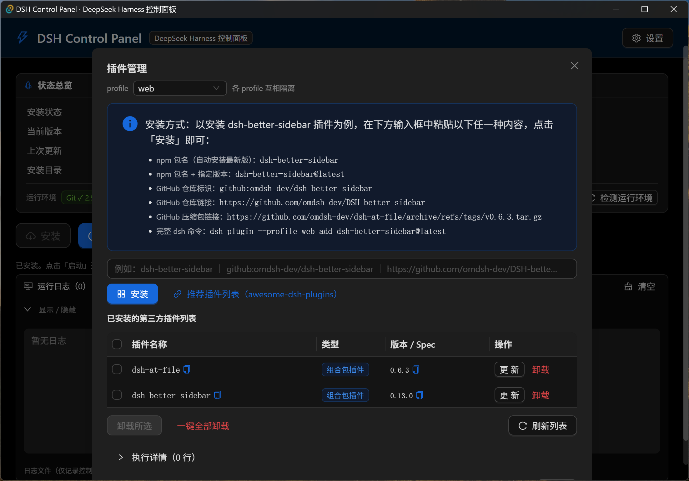

# DSH Control Panel（DSH 控制面板）

[](LICENSE)
[](https://github.com/CrandyChen/dsh-control-panel/actions/workflows/build.yml)

**DSH Control Panel** 是面向 [DeepSeek Harness](https://github.com/deepseek-ai/deepseek-harness)（DSH）的 Windows 桌面图形化控制面板：安装、启动、停止、更新、修复、卸载、运行 DeepSeek Harness 程序，并管理它的插件。也可将其当做DSH的桌面端使用。

[English](README-EN.md)

## 这是什么？

DSH Control Panel 把 DeepSeek Harness 常用的**安装**、**更新**、**卸载**、**启动**、**停止**、**修复**、**插件管理**等终端命令行操作封装成图形界面，便于新手操作。同时也内置了web访问能力，可将其当做 DSH 的桌面端使用。

- **便携自足**：基于 Tauri 2 开发，便携版，解压即用；Node.js 等依赖在首次安装时自动下载。
- **DSH 双安装模式**：默认下载**预构建内核**；也可从官方源码安装。
- **及时更新**：自动检测 DSH 最新版本，用户可选择自动升级到最新版本。
- **不侵入 DSH**：只封装 DSH 相关命令行操作，不修改其源码。

## 系统要求

| 项 | 说明 |
| --- | --- |
| Windows | 10 / 11（64 位） |
| WebView2 Runtime | Win11 自带；Win10 缺失时到微软官网安装 |

**程序中已内置Git客户端功能，Node.js、pnpm 在首次安装时自动下载，均无需单独安装。**


## 安装 DeepSeek Harness（两种模式）

点击「安装」后选择安装方式：

- **预构建内核（默认）**：自动从 GitHub（[deepseek-harness-pkg](https://github.com/dsh-tauri-desk/deepseek-harness-pkg)）下载最新 `deepseek-harness-pkg-windows.zip`。
- **从源码安装**：自动通过 `git clone`官方源码 → `pnpm install` → `pnpm run build`的方式安装。


## 功能总览

### 1. DSH 启动 / 停止
- 启动 DeepSeek Harness web 服务，就绪后按「打开界面默认方式」设置自动打开（默认程序内标签页，可改为系统浏览器，见「设置」）；「停止」结束整个进程树。
- 后台运行：DSH 作为独立进程持续运行，关闭本控制面板不影响 DSH。

### 2. DSH 更新
- 按安装方式检测更新：预构建内核对比 GitHub 最新 release；源码模式对比官方仓库提交。
- 后台定时自动检测，有新版本时更新按钮显示红色 **NEW** 提示；更新前会自动停止 web 服务。

### 3. DSH 修复安装
- 修复无法正常启动的安装。自动清理异常状态并重建：源码模式走 git 重置 + 重新构建；预构建模式重新下载内核。

### 4. DSH 插件管理
- 图形化安装 / 更新 / 卸载 DSH profile 插件（`dsh plugin`），插件按 profile 互相隔离。
- 支持 npm 包名、`github:owner/repo[#版本]`、GitHub 仓库链接、GitHub 压缩包链接，以及完整的 `dsh plugin` 命令。
- 常见问题自动处理：pnpm 拦截插件构建脚本时自动加入 profile 的 allowBuilds 白名单并重试；web 服务运行中的插件操作会**自动停止服务**，操作完成后**自动重启服务**。

### 5. DSH 卸载
- 移除 DeepSeek Harness，范围共两项，可选：「安装目录」与「DSH 用户数据目录」（~/.dsh，个人数据：插件、配置、凭据、会话记录、Agent 预设等）。

### 6. 其他工具
- **打开终端**：在安装目录打开 PowerShell。
- **打开界面**：在系统浏览器或程序内新标签页打开 DSH Web 界面（可配置）。
- **日志**：exe 同目录按天轮转的日志文件（保留 5 份），面板内实时查看。
- **设置**：定时检测新版本及间隔、定时检测插件更新及间隔、主题、语言等。

## 界面截图

主界面
 

插件管理
 

## 下载与安装

- 到 [Releases](https://github.com/CrandyChen/dsh-control-panel/releases) 下载便携版 zip：
  解压后双击 `DSH-Control-Panel.exe` 即可，无需安装（Node.js/pnpm 在首次安装/启动时自动下载，Git 已内置）。
- 或从源码构建（见下）。

## 开发环境

构建控制面板本身需要：

- Node.js ≥ 22.19 或 ≥ 24、pnpm ≥ 11.7
- Rust（rustup stable）+ VS Build Tools（勾选「使用 C++ 的桌面开发」）
- WebView2 Runtime（Win10/11 自带）

```bash
pnpm install
pnpm tauri dev          # 开发模式（热更新）
pnpm tauri build        # 构建 exe
pnpm portable           # 构建并打包便携 zip → dist-portable/（默认内置运行时）
pnpm portable --no-runtime   # 打包不内置运行时的轻量 zip（首次安装时自动下载运行环境）
```

## 许可

[MIT](LICENSE) © 2026 DSH Control Panel Contributors
