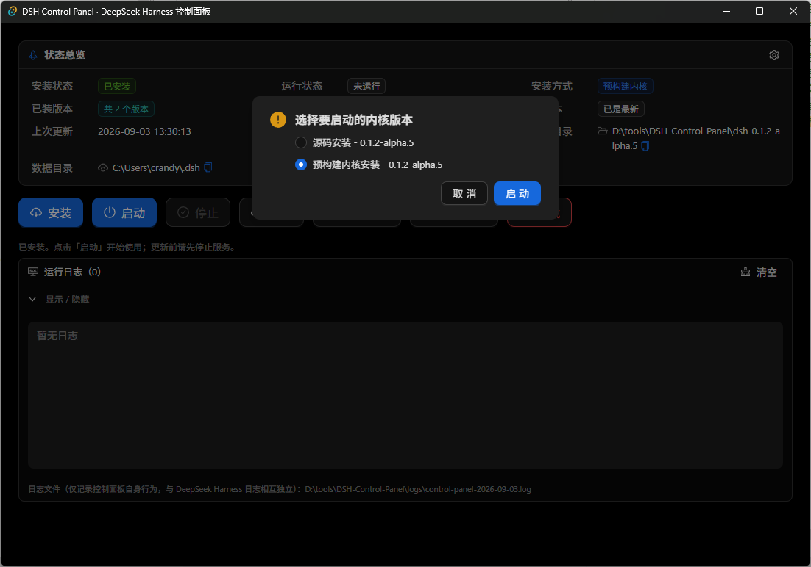
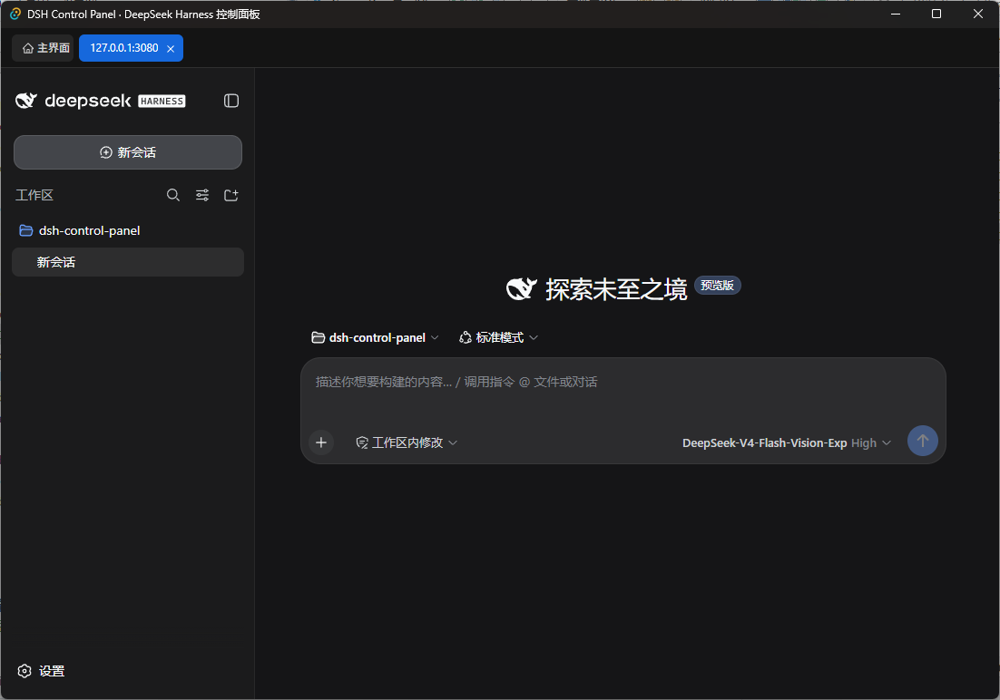

# DSH Control Panel（DSH 控制面板）

[](LICENSE)
[](https://github.com/CrandyChen/dsh-control-panel/actions/workflows/build.yml)

**DSH Control Panel** 是面向 [DeepSeek Harness](https://github.com/deepseek-ai/deepseek-harness)（DSH）的 Windows 桌面图形化控制面板：安装、启动、停止、更新、修复、卸载、运行 DeepSeek Harness 程序，并管理它的插件。也可将其当做DSH的桌面端使用。

[English](README-EN.md)

## 这是什么？

DSH Control Panel 把 DeepSeek Harness 常用的**安装**、**更新**、**卸载**、**启动**、**停止**、**修复**、**插件管理**等终端命令行操作封装成图形界面，便于新手操作。同时内置了DeepSeek Harness 的 Web 页面，可将其当做 DSH 的桌面端使用。

- **便携自足**：基于 Tauri 2 开发，便携版（小于10M），解压即用；Node.js 等依赖在首次安装时自动下载。
- **DSH 双安装方式**：默认通过下载**预构建内核**安装，也可选择自动从**官方源码**构建安装。
- **多版本内核管理**：支持同时安装/管理多个 DSH 内核版本，内核间互相独立，互不影响，可按需启动特定版本；所有版本共用同一数据目录（~/.dsh，含 API 凭据、历史对话、插件等）。
- **及时更新**：自动检测 DSH 最新版本，用户可选择更新到最新版本。
- **不侵入 DSH**：只封装 DSH 相关命令行操作，不修改其源码。

## 系统要求

| 项 | 说明 |
| --- | --- |
| Windows | 10 / 11（64 位） |
| WebView2 Runtime | Win11 自带；Win10 缺失时到微软官网安装 |

**程序中已内置Git客户端功能，Node.js、pnpm 在首次安装时自动下载，均无需单独安装。**


## 安装 DeepSeek Harness（两种方式、多版本）

安装位置固定为程序所在目录。预构建内核按版本解压到 `dsh-<版本>` 子目录（各版本独立）；源码安装按版本克隆到 `dsh-src-<版本>` 子目录（各版本独立）。程序启动时检测本目录下的 DSH 安装情况，发现已有安装会自动关联。

点击「安装」后选择安装方式：

- **预构建内核（默认）**：安装弹窗会列出 GitHub（[deepseek-harness-pkg](https://github.com/dsh-tauri-desk/deepseek-harness-pkg)）发布的可安装版本，可任选其一安装；也可直接安装最新版本。同一版本若已安装则标记「已安装」，并提供**修复安装**。
- **从源码安装**：自动从官方代码仓库安装最新版本（`git clone` 官方源码 → `pnpm install` → `pnpm run build`）；已安装时该方式提供**修复安装**。

## 功能总览

### 1. DSH 启动 / 停止
- 点击「启动」，若已安装多个内核版本，会弹出选择框让用户选择启动哪个内核。
- 启动 DeepSeek Harness web 服务，就绪后按「打开界面默认方式」设置，通过内置Tab页面或系统默认浏览器打开Web页面；「停止」结束整个进程树。
- 后台运行：DSH 作为独立进程持续运行，关闭本控制面板不影响 DSH。

### 2. DSH 更新
- 按安装方式检测更新：预构建内核对比 [deepseek-harness-pkg](https://github.com/dsh-tauri-desk/deepseek-harness-pkg) 最新 release；源码模式对比官方源码仓库的 CLI 版本。
- 后台定时自动检测，有新版本时更新按钮显示红色 **NEW** 提示；更新前会自动停止 web 服务。
- 点击「更新」会弹出详情对话框，以简洁列表展示所有已安装内核（安装方式 / 当前版本 / 新版本），可勾选要更新的内核（可跨安装方式多选）。同一安装方式勾选多个版本时只安装该方式的最新版本。
- 对话框提供「升级后保留当前版本」勾选项（默认不勾选）：不勾选时安装最新内核后删除被勾选的旧版本；勾选时等同新装最新版并保留所有勾选的当前版本。更新到的新版本作为独立内核安装并设为当前使用版本，旧版本可切换/卸载。

### 3. DSH 修复安装
- 对指定内核版本执行修复：清理异常状态并重建。源码模式走 git 重置 + 重新构建；预构建模式重新下载并解压该版本内核。
- 修复入口位于安装弹窗：对已安装版本点击「修复安装」。

### 4. DSH 插件管理
- 图形化安装 / 更新 / 卸载 DSH profile 插件（`dsh plugin`），插件按 profile 互相隔离。
- 支持 npm 包名、`github:owner/repo[#版本]`、GitHub 仓库链接、GitHub 压缩包链接，以及完整的 `dsh plugin` 命令。
- 支持勾选多个插件「更新所选」批量更新。
- 常见问题自动处理：pnpm 拦截插件构建脚本时自动加入 profile 的 allowBuilds 白名单并重试；web 服务运行中的插件操作会**自动停止服务**，操作完成后**自动重启服务**。

### 5. DSH 卸载
- 卸载弹窗会列出所有已安装的内核版本（每项注明安装方式与版本），支持多选删除；另含「DSH 用户数据目录」（~/.dsh，个人数据：插件、配置、凭据、会话记录、Agent 预设等）作为可选项。
- 删除某个内核版本后，其余版本不受影响。

## 界面截图

主界面
 
 
 启动选择
 
 
 DSH Web页面
 

插件管理
 

## 下载与安装

- 到 [Releases](https://github.com/CrandyChen/dsh-control-panel/releases) 下载便携版 zip：
  解压后双击 `DSH-Control-Panel.exe` 即可，无需安装（Node.js/pnpm 在首次安装/启动时自动下载，Git 已内置）。
- 或从源码构建（见下）。

## 开发环境

构建控制面板本身需要：

- Node.js ≥ 22.19 或 ≥ 24、pnpm ≥ 11.7
- Rust（rustup stable）+ VS Build Tools（勾选「使用 C++ 的桌面开发」）
- WebView2 Runtime（Win10/11 自带）

```bash
pnpm install
pnpm tauri dev          # 开发模式（热更新）
pnpm tauri build        # 构建 exe
pnpm portable           # 构建并打包便携 zip → dist-portable/（默认内置运行时）
pnpm portable --no-runtime   # 打包不内置运行时的轻量 zip（首次安装时自动下载运行环境）
```

## 许可

[MIT](LICENSE) © 2026 DSH Control Panel Contributors
