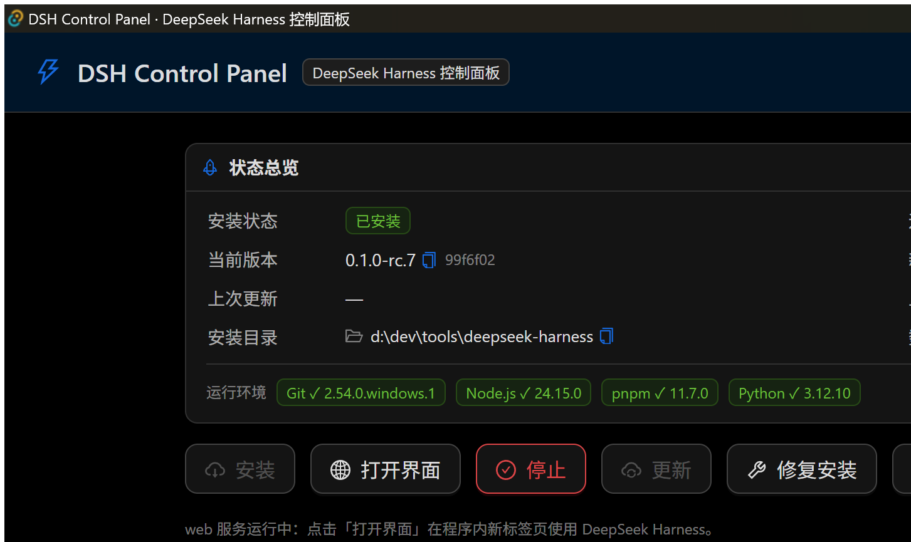
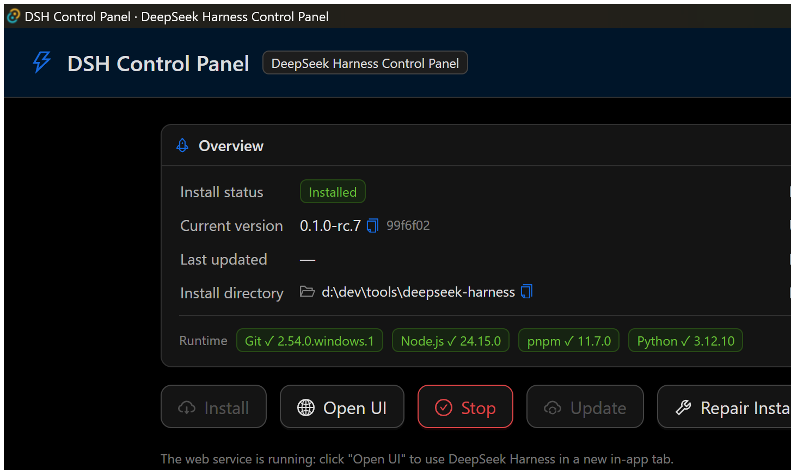

# DSH Control Panel

[](LICENSE)
[](https://github.com/<your-user>/dsh-control-panel/actions/workflows/build.yml)

**DSH Control Panel** is a friendly Windows desktop GUI for
[DeepSeek Harness](https://github.com/deepseek-ai/deepseek-harness) (DSH).
It installs, starts, stops, updates, repairs and uninstalls DeepSeek Harness,
and manages its plugins — without ever making you touch a command line.

[简体中文](README.zh-CN.md)

## What is it?

DeepSeek Harness is installed and run from a terminal: `git clone`, `pnpm install`,
`pnpm run build`, `pnpm dsh web`, and `dsh plugin ...` for plugins. DSH Control Panel
wraps all of that behind a simple GUI:

- **Friendly UI** built with React 18 + antd 5, dark / light themes, English and
  Simplified Chinese, step-by-step dialogs and a live log panel.
- **Tauri 2** desktop shell (Rust backend) — a single, small, portable `exe`, no
  runtime installation required (Windows 10/11 with WebView2).
- **Newbie-friendly**: the panel detects your environment, points you to install
  guides when Git / Node.js / pnpm are missing, pre-checks network reachability, and
  explains every failure in plain language.
- **Non-invasive**: it only runs standard `git` / `pnpm` commands. It never modifies
  DeepSeek Harness sources, and it never touches your `~/.dsh` user data
  (skills, settings, credentials, plugins) unless you explicitly uninstall.

## Runtime requirements (to install DSH)

| Tool | Requirement | Note |
| --- | --- | --- |
| Windows | 10 / 11 (64-bit) | WebView2 Runtime (built into Win11; install from Microsoft if missing on Win10) |
| Git | any recent version | used to clone / update DeepSeek Harness |
| Node.js | ≥ 22.19 or ≥ 24 | per DeepSeek Harness engines (LTS recommended) |
| pnpm | ≥ 11.7 | Node.js must be installed first |
| Python | recommended, optional | some DSH extensions use it; not required for install/start/update |

The panel checks all of this automatically on startup and shows a step-by-step
install guide (official download links + `winget` / `npm` commands) if anything is
missing or too old.

## Feature overview

Each feature below lists what it does, how to use it, and the CLI commands it wraps.

### 1. Install
- **What**: clone the official repository, install dependencies and build the web UI.
- **Use**: click **Install**, choose any parent directory — the panel creates the
  `deepseek-harness` subdirectory automatically. Progress and errors stream into the
  log panel in real time. A network pre-check runs before cloning.
- **Commands wrapped**: `git clone https://github.com/deepseek-ai/deepseek-harness.git`
  → `pnpm install` → `pnpm run build`.

### 2. Start / Stop
- **What**: launch or terminate the DeepSeek Harness web service (process tree
  management, port 3080).
- **Use**: click **Start**; the built-in browser tab opens the UI at
  `http://127.0.0.1:3080` when ready. **Stop** ends the process tree.
- **Command wrapped**: `pnpm dsh web`.

### 3. Update
- **What**: one button that checks for a new version and, when one exists, shows a
  dialog with details (current/latest commit, commits behind, update subject) and
  lets you choose **Update Now** or **Ignore**. A background timer checks periodically
  and a red **NEW** badge appears on the button when an update is available.
- **Use**: click **Update** → review the dialog → confirm. The web service is stopped
  automatically before updating.
- **Commands wrapped**: `git fetch` / `git rev-parse` / `git rev-list --count` /
  `git log` (check) → `git pull --ff-only` → `pnpm install` → `pnpm run build` (apply).

### 4. Repair Install
- **What**: fix an installation that cannot start (typically after an interrupted
  plugin install/update left abnormal state behind). It cleans lock/state files and
  stray processes, resets the repository to the official code and rebuilds, escalating
  to deeper repairs (reinstall dependencies, repair profiles) and — as a last resort —
  deleting and re-cloning the installation.
- **Use**: click **Repair Install** (also suggested automatically with a friendly
  dialog when DSH fails to start). Review the risks first: local uncommitted changes
  in the installation are discarded; `~/.dsh` settings/credentials/plugin list are
  kept, but plugins of a corrupted profile may need reinstalling.
- **Commands wrapped**: `git fetch` → `git reset --hard origin/<branch>` →
  `git clean -fdx` → `pnpm install` → `pnpm run build` (deep: remove `node_modules`;
  fallback: full re-clone).

### 5. Plugin Manager
- **What**: install, update and remove DSH profile plugins (`dsh plugin`) from a GUI:
  smart input (npm package names, `github:owner/repo[#ref]`, GitHub links or full
  commands), multi-select / one-click removal, per-profile isolation, and automatic
  handling of two common pnpm pitfalls (blocked build scripts → allowBuilds fix;
  global `dsh` unavailable → switch to `pnpm dsh`).
- **Use**: open **Plugins**; while the web service is running only **installing** is
  allowed (updating/removing is blocked until you stop the service), and after an
  install you are reminded to restart DSH for it to take effect.
- **Commands wrapped**: `dsh plugin --profile <name> add|update|remove <spec...>`.

### 6. Uninstall
- **What**: completely remove DeepSeek Harness.
- **Use**: click **Uninstall**, confirm the coarse-grained checklist — exactly two
  items: the **installation directory** and the **DSH user data directory**
  (`~/.dsh`, containing skills, settings, credentials, sessions and plugins). Paths
  are validated against a safety guard before deletion.
- **Commands wrapped**: none (direct directory deletion with safe-path checks).

### 7. Utilities
- **Open Terminal**: opens PowerShell inside the installation directory
  (`powershell -NoExit`).
- **Open UI**: opens the DSH web UI in the system browser.
- **Built-in browser**: multi-tab iframe browser inside the panel (DSH UI, install
  guide, any http/https page).
- **Runtime check**: re-detects Git / Node.js / pnpm / Python and opens the install
  guide.
- **Logs**: day-rotated log files (5 kept) beside the exe, live in the panel.
- **Settings**: scheduled update check & interval, theme, language (auto / 简体中文 /
  English, persisted in `config.json`), default UI open mode. The panel's own
  `config.json` and logs live next to the `exe` (portable semantics).

## Screenshots

> Screenshots live in [`assets/`](assets/) and are referenced here. To add or replace
> one, save a PNG into `assets/` and update the table below.

| Main view (Chinese) | Main view (English) |
| --- | --- |
|  |  |

## Download & install

- Portable zip from the [Releases](https://github.com/<your-user>/dsh-control-panel/releases)
  page: download, unzip, run `DSH-Control-Panel.exe`. No installation needed.
- Or build from source (see below).

## Development environment

- Node.js ≥ 22.19 or ≥ 24, pnpm ≥ 11.7
- Rust (rustup stable) + VS Build Tools with the "Desktop development with C++" workload
- WebView2 Runtime (built into Win10/11)

```bash
pnpm install
pnpm tauri dev          # development mode (hot reload)
pnpm tauri build        # build the exe
pnpm portable           # build + pack portable zip → dist-portable/
```

> China mainland network tips: point cargo at a mirror such as rsproxy.cn
> (`~/.cargo/config.toml`) and pnpm at the npmmirror registry (user-level config,
> do not commit it).

## Repository structure

```
src/                     React frontend (antd 5, dark/light theme, i18n zh-CN/en)
  i18n.ts                UI dictionary (Chinese + English)
  usePanel.ts            core state hook (config/detect/phase/logs/tabs/actions)
  components/            dialogs & panels (install/update/repair/plugins/uninstall/…)
src-tauri/src/           Rust backend (config/logging/process/detect/tools/net/version/
                         install/update/repair/uninstall/web/plugin/terminal/i18n)
scripts/                 portable packaging (pnpm portable)
assets/                  screenshots referenced by the README
.github/workflows/       CI: build.yml (checks) + release.yml (tag → portable zip)
```

- Requirements / design / process documents are kept **locally** in `docs/` and are
  intentionally **not** committed to this repository (see `.gitignore`).

## Contributing

See [CONTRIBUTING.md](CONTRIBUTING.md) for the branch / PR / release workflow.

## License

[MIT](LICENSE) © 2026 DSH Control Panel Contributors
